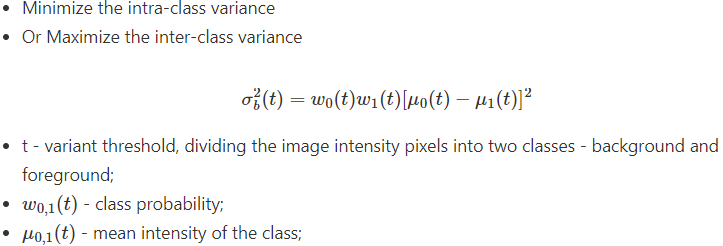

# Algorithm list

模板匹配
1. See [Correspondence Matching](https://www.cse.psu.edu/~rtc12/CSE486/lecture07.pdf), explanation of why template matching uses Normalized Cross Correlation as
2. [An improved template matching with rotation and scale invariant](https://forum.opencv.org/t/an-improved-template-matching-with-rotation-and-scale-invariant/5566)

斑点分析
1. Top-hat transform to get a more uniform background
2. apply otsu thresholding and [code](https://github.com/EeToSe/image-cv/blob/main/myfunc/otsu.py)

圆查找
1. [Hough transform](http://16385.courses.cs.cmu.edu/spring2022/lecture/hough) 
2. [cv.HoughCircles](https://docs.opencv.org/4.x/da/d53/tutorial_py_houghcircles.html)

直线交点
1. [https://stackoverflow.com/questions/46565975/find-intersection-point-of-two-lines-drawn-using-houghlines-opencv](https://stackoverflow.com/questions/46565975/find-intersection-point-of-two-lines-drawn-using-houghlines-opencv)

矩形查找
1. cv.findContours & cv.boundingRect
2. [OpenCV - How to find rectangle contour of a rectangle with round corner?](https://stackoverflow.com/questions/46486078/opencv-how-to-find-rectangle-contour-of-a-rectangle-with-round-corner)

圆拟合 & 圆周测量
1. [cv.findContours & cv.fitEllipse](https://docs.opencv.org/3.4/d3/dc0/group__imgproc__shape.html#ga95f5b48d01abc7c2e0732db24689837b)
2. [Demo: Creating Bounding rotated boxes and ellipses for contours](https://docs.opencv.org/3.4/de/d62/tutorial_bounding_rotated_ellipses.html)

直线拟合
1. Least squares method
2. [cv.fitLine](http://amroamroamro.github.io/mexopencv/matlab/cv.fitLine.html)

形状异常/轮廓残缺  
Concepts in Mathematical Morphology(see the attached) might be of great help.
1. **Hit-or-miss** transformation: basic tool for shape detection.
2. **Morphological Reconstruction**: extract the connected particles.
   